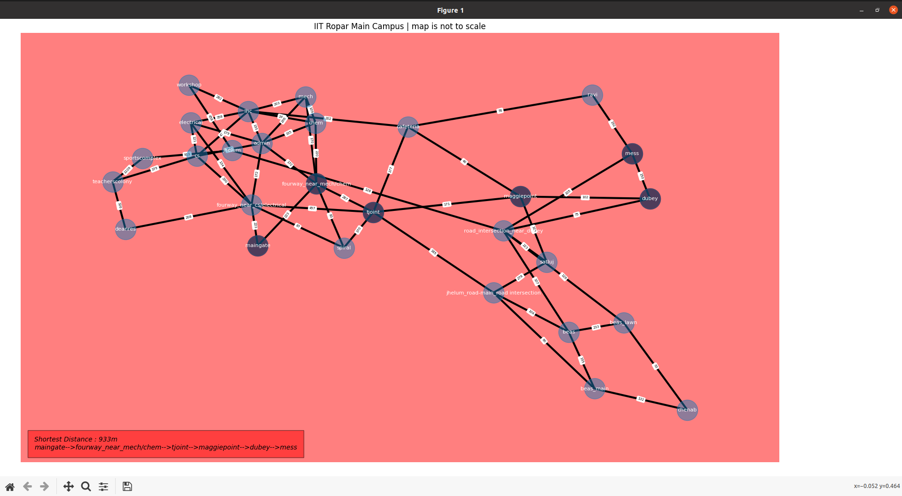
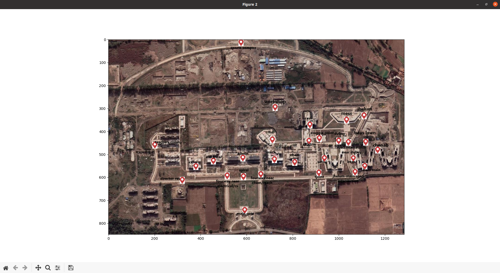

#                           GE103 Project 
## Shortest path between two points on a map using Dijkstra's Algorithm.
### Requirements:
1. matplotlib
2. networkx

### Brief description about the algorithm
Dijkstra's algorithm can be used to solve a wide variety of complex problems. The algorithm is written in
the context of weighted graphs, so all of the language reflects that (nodes, costs, etc). However, this solution will work on
anything that can be abstracted to a series of nodes that are connected and have values attached to those connections. It can be
used to manage networks, to control the movement of adversaries in video games, or to guide cars along their route. An
advanced version of Dijkstra’s algorithm is used in google maps which is one of the most commonly used route-finding
application.

### Installation: on linux
    sudo pip3 install matplotlib
    sudo pip3 install networkx
    git clone https://github.com/Arpit078/GE103-Project.git
    cd GE103-project
    python3 ge103project.py
### Screen Shots:

### Contributers:
1. [Akshit Pal](https://github.com/AkshPal)
2. [Anmol Yadav](https://github.com/Anmol7777)
3. Harshal Sandhu
4. [Arpit Verma](https://github.com/Arpit078)